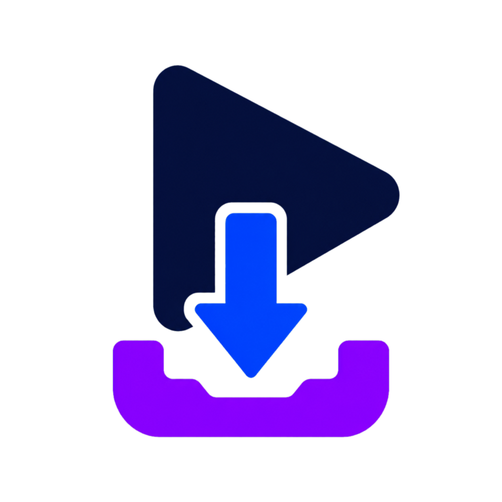
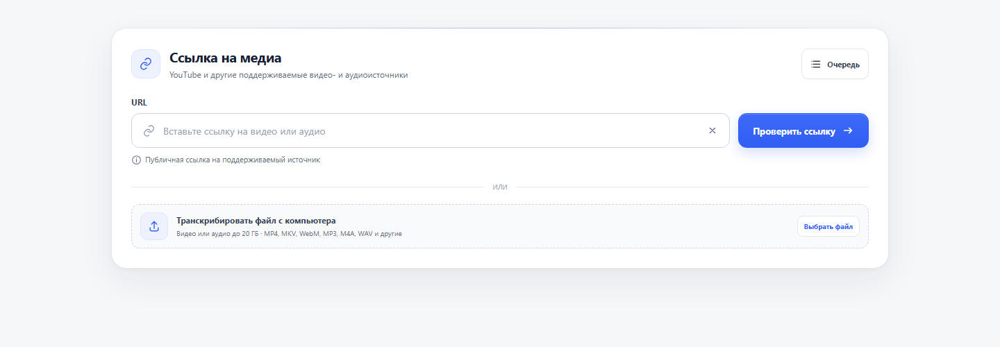

<p align="center">
  
</p>

<h1 align="center">StreamDock</h1>

<p align="center">
  Локальное приложение для скачивания видео, аудио и точной транскрибации на Windows.
</p>

<p align="center">
  <a href="https://github.com/arseniy-io/StreamDock/actions/workflows/ci.yml"></a>
  
  
  <a href="LICENSE"></a>
</p>

StreamDock скачивает видео и аудио, создаёт транскрибации и помогает сохранять медиапотоки из Chrome. Обработка речи выполняется на компьютере пользователя без облачных API и платных сервисов.

> Для получения медиа по ссылке и первой загрузки моделей нужен интернет. После загрузки моделей транскрибация локальных файлов может выполняться без подключения к сети.

<p align="center">
  
</p>

## Возможности

### Видео и аудио

- анализ ссылок YouTube, Rutube, VK Video, Vimeo, Dailymotion, TikTok, Twitch и SoundCloud;
- название, автор, превью, длительность и доступные варианты качества;
- скачивание видео в MP4 с выбором качества, включая объединение отдельных видео- и аудиодорожек через FFmpeg;
- скачивание аудио в MP3, M4A или исходном формате;
- MP3 с качеством от 128 до 320 кбит/с;
- выбор отдельного временного фрагмента вместо всего материала;
- прогресс по этапам, скорость, оставшееся время и отмена операции;
- очередь до 50 ссылок или элементов плейлиста с последовательной обработкой;
- сохранение успешных результатов очереди, даже если отдельные элементы завершились ошибкой.

### Транскрибация

- транскрибация видео по ссылке;
- загрузка собственного видео- или аудиофайла размером до 20 ГБ;
- автоматический выбор источника текста: ручные субтитры, автоматические субтитры или локальное распознавание речи;
- три режима распознавания: GigaAM, Whisper и совместный режим GigaAM + Whisper;
- модели Whisper `tiny`, `base`, `small`, `medium` и `large-v3`;
- русский и английский языки, а для Whisper - автоматическое определение языка;
- встроенный технический словарь и пользовательские термины для конкретной записи;
- временные метки, объединение коротких реплик в абзацы и удаление пустых фрагментов;
- экспорт в Markdown, TXT, SRT и VTT;
- необязательное локальное разделение по спикерам: автоматическое определение или указание от 2 до 10 участников;
- встроенный редактор Markdown с поиском и сохранением изменений.

Markdown является основным форматом. Он содержит сведения об источнике, модели и языке, а сама транскрибация разбивается на читаемые смысловые блоки.

### Расширение Chrome

Расширение StreamDock замечает HLS, DASH и обычные медиапотоки на открытой странице и передаёт выбранный поток локальному приложению. Это позволяет работать со страницами, доступными только в текущем сеансе браузера.

- медиаданные не отправляются в облако или сторонний API;
- адрес потока и необходимые заголовки доступа хранятся только в памяти текущего сеанса Chrome;
- прогресс открывается в отдельной постоянной вкладке;
- локальное приложение можно запускать и останавливать из расширения;
- DRM не поддерживается и не обходится;
- запись прямого эфира начинается с момента подключения к найденному потоку.

## Быстрый запуск

StreamDock рассчитан на 64-разрядные Windows 10 и Windows 11.

1. Скачайте архив публичного релиза или клонируйте репозиторий.
2. Запустите `install.bat` и дождитесь завершения проверки и установки компонентов.
3. При желании заранее загрузите рекомендуемый набор моделей через `download_models.bat`. Этот шаг необязателен.
4. Запустите приложение через `start.bat`.
5. Откройте `http://127.0.0.1:8765`, если браузер не открылся автоматически.

`install.bat` находит 64-разрядный Python 3.11+, подготавливает виртуальное окружение, устанавливает проверенные версии зависимостей и регистрирует локальный помощник расширения. FFmpeg и Node.js проверяются отдельно: если их нет, установщик показывает команды установки. Само приложение при этом остаётся доступно, но часть загрузок и преобразований может не работать.

Подробная установка, ручной запуск и решение типичных проблем описаны в [docs/INSTALLATION.md](docs/INSTALLATION.md).

### Установка расширения Chrome

1. Сначала выполните `install.bat`.
2. Откройте `chrome://extensions`.
3. Включите режим разработчика.
4. Нажмите «Загрузить распакованное расширение».
5. Выберите папку `browser-extension` из проекта.
6. Закрепите StreamDock на панели Chrome.

После установки откройте страницу с видео и включите воспроизведение на несколько секунд. Затем нажмите значок StreamDock и выберите найденный поток. Подробнее: [browser-extension/README.md](browser-extension/README.md).

## Основные сценарии

### Скачать по ссылке

1. Вставьте ссылку и нажмите «Проверить ссылку».
2. Откройте вкладку «Видео» или «Аудио».
3. Выберите качество, формат и при необходимости временной диапазон.
4. Запустите скачивание и дождитесь готового файла.

### Получить только транскрибацию

1. Вставьте ссылку или выберите локальный файл.
2. Откройте вкладку «Текст».
3. Выберите источник текста, режим распознавания и форматы результата.
4. При необходимости добавьте свои термины или включите разделение спикеров.
5. Запустите обработку. По завершении скачайте Markdown, TXT, SRT или VTT.

### Обработать несколько материалов

Откройте второстепенный блок «Очередь ссылок», вставьте до 50 ссылок или одну ссылку на плейлист и выберите нужные элементы. Очередь может скачать видео, аудио или создать транскрибации. Для текста используются настройки вкладки «Текст».

## Режимы распознавания

| Режим | Для чего подходит | Особенности |
| --- | --- | --- |
| **Совместный** | Русские технические видео, вебинары и обучение | GigaAM распознаёт запись, а Whisper `large-v3` выборочно проверяет сложные термины |
| **GigaAM** | Быстрая транскрибация русской речи | Работает на CPU, требует меньше ресурсов, чем полный Whisper `large-v3` |
| **Whisper** | Русский, английский и другие языки | Позволяет выбрать размер модели; самые крупные модели точнее, но заметно медленнее |

Если у видео есть подходящие готовые субтитры, автоматический режим сначала использует их и не запускает модель без необходимости.

На тестовой серии русских материалов совместный режим работал быстрее полного Whisper `large-v3` и улучшал распознавание технических терминов относительно чистого GigaAM. Это не означает, что он будет точнее на любой записи. Методика и ограничения приведены в [docs/HYBRID_BENCHMARK.md](docs/HYBRID_BENCHMARK.md).

## Локальные модели

Модели намеренно **не входят в Git-репозиторий**: отдельные варианты занимают от десятков или сотен мегабайт до нескольких гигабайт.

- нужная модель автоматически скачивается при первом использовании;
- `download_models.bat` по умолчанию заранее загружает GigaAM, Whisper `large-v3` и компактные модели разделения спикеров;
- после загрузки модели хранятся локально в папке `models` и повторно не скачиваются;
- GigaAM и детектор речи занимают несколько сотен мегабайт;
- Whisper занимает от сравнительно небольшого объёма для `tiny` до нескольких гигабайт для `large-v3`;
- модели разделения спикеров занимают дополнительное место и загружаются при первом использовании функции или заранее через `download_models.bat`.

Размеры зависят от версии и формата модели, поэтому перед установкой крупного Whisper рекомендуется иметь несколько гигабайт свободного места с запасом. Подробнее: [docs/MODELS.md](docs/MODELS.md).

## Ориентировочные требования

Это практические ориентиры, а не строгие минимальные требования. Скорость сильно зависит от длительности записи, выбранной модели и конкретного процессора.

| Сценарий | Процессор и память | Дополнительно |
| --- | --- | --- |
| Скачивание видео и аудио | Современный 4-ядерный процессор, 8 ГБ ОЗУ | Свободное место не меньше размера итогового файла |
| GigaAM и совместный режим | Современный 6-ядерный процессор, 16 ГБ ОЗУ | Несколько гигабайт свободного места для моделей и временных файлов |
| Whisper `large-v3` | 16 ГБ ОЗУ или больше; 32 ГБ комфортнее для тяжёлых задач | NVIDIA с поддерживаемой CUDA может заметно ускорить обработку, но не обязательна |
| Разделение спикеров | 16 ГБ ОЗУ рекомендуется | Дополнительная нагрузка на CPU и дополнительное время обработки |

На компьютере без совместимой видеокарты Whisper автоматически использует CPU. GigaAM и разделение спикеров в текущей версии работают локально через CPU.

## Обновление и удаление

- Сначала получите новую версию исходных файлов, затем запустите `update.bat` для обновления зависимостей и локального помощника. Сам `update.bat` не скачивает исходный код.
- Перед удалением скопируйте нужные файлы из папки `downloads`.
- Запустите `uninstall.bat`, чтобы удалить регистрацию локального помощника Chrome.
- После этого папку проекта можно удалить вручную.

Модели, загрузки и логи хранятся внутри папки проекта и не отправляются во внешнее хранилище.

## Безопасность и конфиденциальность

- сервер слушает только `127.0.0.1` и не открывается для других устройств сети;
- произвольные аргументы FFmpeg, yt-dlp и моделей не принимаются от интерфейса;
- имена файлов очищаются от запрещённых в Windows символов;
- локальные пути и адреса внутренней сети блокируются в загрузках расширения;
- команды внешних программ запускаются списком аргументов без `shell=True`;
- технические ошибки записываются в локальную папку `logs`;
- облачные API, API-ключи и платные сервисы для транскрибации не используются.

Расширение временно работает с адресами потоков, cookies и заголовками авторизации текущей страницы. Не публикуйте необработанные логи и диагностические данные, не просмотрев их содержимое.

Если вы нашли уязвимость, не создавайте публичную задачу с секретными данными. Используйте порядок из [SECURITY.md](SECURITY.md).

## Ограничения

- StreamDock не обходит DRM, платные ограничения и ограничения чужих аккаунтов.
- Скачивайте только материалы, на сохранение которых у вас есть право или разрешение.
- Приватные, возрастные и регионально ограниченные материалы могут быть недоступны обычной загрузке по ссылке.
- Поддержка сайтов зависит от их текущего устройства и от `yt-dlp`; после изменений на стороне сайта может потребоваться обновление через `update.bat`.
- Автоматическое разделение спикеров может ошибаться на музыке, шуме, коротких репликах и одновременно говорящих людях.
- Совместный режим рассчитан прежде всего на русскую речь. Для других языков используйте Whisper.
- Перезапуск приложения прерывает активные операции.

## Разработка

Основной стек:

- Python 3.11+;
- FastAPI и Uvicorn;
- yt-dlp и FFmpeg;
- faster-whisper;
- GigaAM через onnx-asr;
- sherpa-onnx для локального разделения спикеров;
- HTML, CSS и JavaScript без frontend-фреймворка.

Ручная установка окружения для разработки:

```powershell
python -m venv .venv
.venv\Scripts\python.exe -m pip install -r requirements-dev.txt -c constraints.txt
```

Запуск проверок:

```powershell
.venv\Scripts\python.exe -m pytest
.venv\Scripts\python.exe -m compileall -q app tests
```

Тесты не скачивают большие реальные видео: внешние запросы заменяются небольшими тестовыми данными и заглушками.

Ключевые документы:

- [docs/INSTALLATION.md](docs/INSTALLATION.md) - установка, запуск и обновление;
- [docs/MODELS.md](docs/MODELS.md) - выбор и хранение моделей;
- [docs/ARCHITECTURE.md](docs/ARCHITECTURE.md) - устройство backend и фоновых задач;
- [docs/HYBRID_BENCHMARK.md](docs/HYBRID_BENCHMARK.md) - сравнение режимов транскрибации;
- [docs/SPEAKER_DIARIZATION_BENCHMARK.md](docs/SPEAKER_DIARIZATION_BENCHMARK.md) - проверка разделения спикеров;
- [docs/STREAMDOCK_RUNTIME.md](docs/STREAMDOCK_RUNTIME.md) - взаимодействие приложения и расширения;
- [DESIGN.md](DESIGN.md) - правила интерфейса;
- [CHANGELOG.md](CHANGELOG.md) - заметные изменения по версиям;
- [CONTRIBUTING.md](CONTRIBUTING.md) - правила участия в разработке.

## Лицензия

Исходный код StreamDock распространяется по лицензии [MIT](LICENSE). Используемые библиотеки, модели и загружаемые материалы могут иметь собственные лицензии и условия использования.
