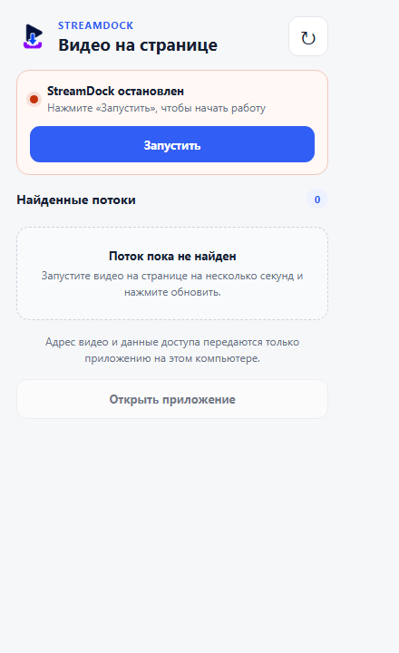

# StreamDock для Chrome

Расширение находит медиапотоки, появившиеся на открытой странице, и передаёт выбранный поток приложению на `http://127.0.0.1:8765`. Видео и данные доступа не отправляются во внешние сервисы.

Расширение полезно для страниц, где невозможно вставить обычную публичную ссылку, в том числе для доступной вам страницы личного кабинета. Оно не обходит DRM, оплату, чужую авторизацию или запреты сайта.

  

## Что умеет расширение

- замечает HLS, DASH и обычные адреса медиа;
- показывает рекомендуемый поток «Видео + звук»;
- передаёт локальному приложению нужные заголовки текущего сеанса;
- запускает и останавливает StreamDock через локальный помощник;
- открывает отдельную вкладку с прогрессом, отменой и результатом.

Расширение только сохраняет медиапоток. Для транскрибации откройте основное приложение и выберите сохранённый файл через «Транскрибировать файл с компьютера».

## Требования

- Google Chrome 102 или новее;
- установленный StreamDock;
- выполненный `install.bat`;
- страница и материал, к которым у вас есть законный доступ.

Microsoft Edge и Firefox официально не поддерживаются в текущей версии. Расширение пока устанавливается распакованным и отсутствует в Chrome Web Store.

## Установка

1. Распакуйте StreamDock в постоянную папку.
2. Один раз запустите `install.bat` в корне проекта.
3. Откройте в Chrome страницу `chrome://extensions`.
4. Включите «Режим разработчика» в правом верхнем углу.
5. Нажмите «Загрузить распакованное расширение».
6. Выберите папку `browser-extension` внутри StreamDock.
7. Закрепите значок StreamDock на панели Chrome.

Не перемещайте папку проекта после установки. Если путь изменился, снова запустите `install.bat` и перезагрузите расширение.

## Первое скачивание

1. Откройте страницу с доступным вам видео.
2. Запустите воспроизведение на несколько секунд.
3. Нажмите значок StreamDock.
4. Если приложение остановлено, нажмите «Запустить».
5. Если список пуст, нажмите круглую кнопку обновления.
6. Выберите первый рекомендуемый поток «Видео + звук».
7. Нажмите «Скачать в хорошем качестве».
8. Следите за задачей в открывшейся отдельной вкладке.

Маленькое окно расширения после начала задачи можно закрыть. Загрузка продолжится в локальном приложении.

Готовый файл сохраняется в папке `downloads` проекта. Кнопка «Открыть папку» на странице прогресса показывает его в Проводнике.

Если страница отдаёт изображение и звук отдельными дорожками, StreamDock ставит общий `master.m3u8` первым и скрывает технические однодорожечные варианты. Приложение выбирает лучшее качество, объединяет дорожки и проверяет итоговый файл.

## Страницы личного кабинета

Расширение использует только текущий сеанс Chrome. Оно может передать локальному приложению временный адрес потока, cookies и необходимые заголовки, которые уже доступны вашему браузеру.

Для надёжного запуска:

- сначала войдите в свой аккаунт обычным способом;
- убедитесь, что видео воспроизводится в Chrome;
- не выходите из аккаунта до начала загрузки;
- не передавайте другим людям найденный адрес потока;
- используйте расширение только для материалов, которые вам разрешено сохранять.

Если сеанс истёк или сайт обновил временный адрес, вернитесь на страницу, снова включите видео и повторите поиск потока.

## Управление приложением

### «Запустить»

Локальный помощник запускает StreamDock на `127.0.0.1:8765`. Системная служба или постоянно работающий облачный сервер не создаются.

### «Остановить»

Кнопка доступна после подтверждённого соединения со StreamDock, в том числе при ручном запуске через `start.bat`. Перед остановкой активной загрузки расширение просит подтверждение.

Backend выдаёт помощнику временный секрет текущего процесса. Команда не должна завершать другие проекты Python или посторонние процессы.

### «Открыть приложение»

Кнопка открывает основной интерфейс. Там можно скачивать по обычной ссылке, выбирать аудиоформат и запускать транскрибацию.

## Отдельная вкладка прогресса

Вкладка показывает:

- текущий этап;
- процент, когда его можно определить;
- скачанный объём, скорость и оставшееся время;
- отмену загрузки;
- кнопку открытия папки после завершения.

Если связь с приложением временно пропала, вкладка продолжает проверять состояние. Закрытие вкладки не отменяет уже созданную локальную задачу.

## Зачем расширение просит доступ к сайтам

Chrome показывает широкое разрешение на чтение сетевых запросов страниц. Оно нужно, чтобы заметить адрес медиапотока на том сайте, который пользователь открыл сам.

StreamDock не отправляет историю браузера в облако. Найденные URL, cookies и заголовки хранятся только в хранилище текущего сеанса Chrome. Копия данных конкретной задачи удаляется после передачи локальному приложению, а список найденных потоков - при перезагрузке или закрытии вкладки и при завершении сеанса браузера. В постоянном хранилище остаются только название, номер задачи и безопасный снимок прогресса последних десяти загрузок.

Исходный код расширения находится в этой папке и доступен для проверки.

## Обновление расширения

1. Закройте активные загрузки.
2. Получите свежие файлы StreamDock.
3. Запустите `update.bat`.
4. Откройте `chrome://extensions`.
5. Нажмите круглую кнопку перезагрузки на карточке StreamDock.

После любого ручного изменения файлов `manifest.json`, `background.js`, popup или страницы прогресса расширение также нужно перезагрузить.

## Если поток не найден

1. Перезагрузите страницу.
2. Включите видео на несколько секунд.
3. Откройте расширение и нажмите обновление.
4. Проверьте, что видео не остановилось из-за ошибки сайта.
5. Попробуйте начать воспроизведение с другого момента.

Поток может не появиться из-за DRM, нестандартного проигрывателя, истёкшего адреса или ограничений самого сайта.

## Если приложение не запускается

1. Снова выполните `install.bat`.
2. Не перемещайте папку StreamDock после установки.
3. Перезагрузите расширение на `chrome://extensions`.
4. Проверьте запуск через обычный `start.bat`.

Если кнопка «Остановить» пропала, также сначала перезагрузите расширение и повторите `install.bat`.

Подробные решения собраны в [docs/TROUBLESHOOTING.md](../docs/TROUBLESHOOTING.md).

## Прямые эфиры и ограничения

Прямой эфир записывается только с момента подключения к найденному потоку. Уже прошедшая часть эфира может быть недоступна.

Потоки с DRM-защитой не поддерживаются и не обходятся. Расширение не гарантирует работу на каждом сайте: проигрыватели и способы выдачи видео регулярно меняются.

## Удаление

1. Завершите загрузки и остановите StreamDock.
2. Запустите `uninstall.bat` в корне проекта.
3. Откройте `chrome://extensions` и удалите StreamDock.
4. При необходимости удалите папку проекта, предварительно сохранив нужные файлы из `downloads`.
